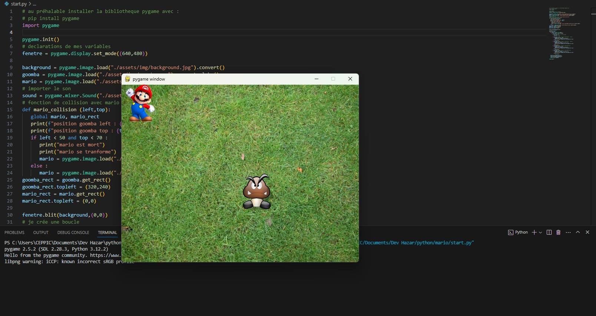

# Pygame project for educative python leaning 

-how to use def 
-conditions
-scope and global vars
-while

```echo "Hello world```
## Screenshots




## Deployment

To use pygame library :
```bash
  pip install pygame
```


## License

[MIT](https://choosealicense.com/licenses/mit/)

